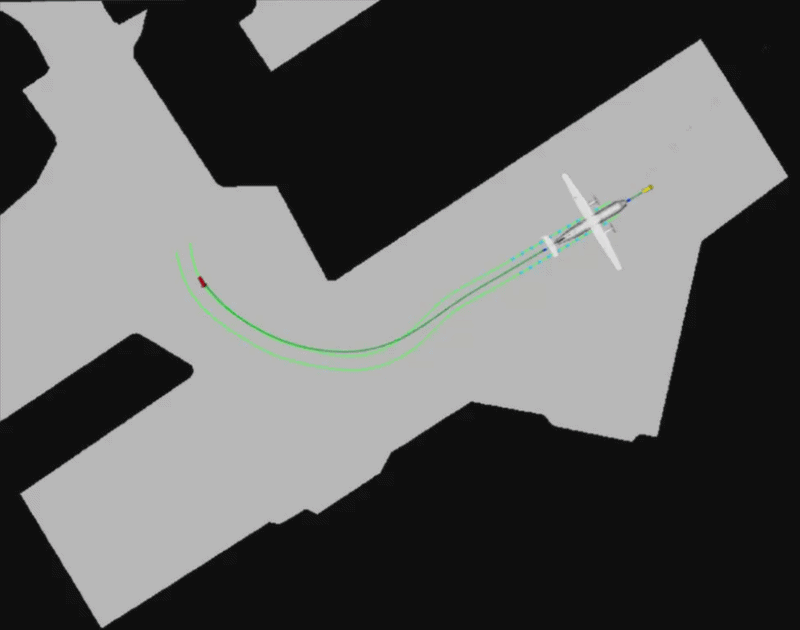

<div align="center">

# Autonomous Aircraft Pushback & Ground Handling Simulation

**Status:** Active

</div>

A ROS 2 Humble simulation and visualization workspace for autonomous aircraft ground handling. It models the kinematics, articulation geometry, and dynamic path tracking of a **Towflexx Clamping Tug** manipulating an **ATR-42 Regional Aircraft** inside an airport hangar environment, and renders the result live in RViz2 using URDF/Xacro vehicle models and hangar occupancy-grid maps.

---

## Table of Contents

- [Preview](#preview)
- [Prerequisites & Installation](#prerequisites--installation)
- [Repository Structure](#repository-structure)
- [How to Set Parameters](#how-to-set-parameters)
- [Execution Guide (How to Run)](#execution-guide-how-to-run)
  - [1. Build the Workspace](#1-build-the-workspace)
  - [2. Regenerate Trajectory Data (Optional)](#2-regenerate-trajectory-data-optional)
  - [3. Full Hangar Pushback Simulation](#3-full-hangar-pushback-simulation)
  - [4. Standalone Tug Simulation](#4-standalone-tug-simulation)
  - [5. Standalone Tug CAD & Joint Inspector](#5-standalone-tug-cad--joint-inspector)
  - [6. Combined System CAD Inspector](#6-combined-system-cad-inspector)
- [Main ROS 2 Nodes](#main-ros-2-nodes)
- [Visualization Reference](#visualization-reference)
- [Troubleshooting](#troubleshooting)

---

## Preview

<p align="center">
  <!-- TODO: add an animated preview (gif) once the remaining simulation work is finished -->
  
</p>

---

## Prerequisites & Installation

* **OS:** Ubuntu 22.04 (or any platform supported by ROS 2 Humble)
* **ROS 2 Humble Hawksbill** — [installation guide](https://docs.ros.org/en/humble/Installation.html)
* **colcon** build tools (`sudo apt install python3-colcon-common-extensions`)
* **ROS 2 packages:** `robot_state_publisher`, `joint_state_publisher_gui`, `rviz2`, `tf2_ros`, `xacro`, `nav2_map_server`, `nav2_lifecycle_manager`

Install the ROS 2 package dependencies:

```bash
sudo apt install ros-humble-robot-state-publisher ros-humble-joint-state-publisher-gui \
                  ros-humble-rviz2 ros-humble-tf2-ros ros-humble-xacro \
                  ros-humble-nav2-map-server ros-humble-nav2-lifecycle-manager
```

Clone the workspace and build it (works from any directory/username — no hardcoded paths):

```bash
git clone <this-repo-url> flight_ws
cd flight_ws
source /opt/ros/humble/setup.bash
colcon build --symlink-install
source install/setup.bash
```

---

## Repository Structure

`build/`, `install/`, and `log/` are colcon-generated output — they're gitignored and recreated by `colcon build`, so they won't appear on a fresh clone.

```text
flight_ws/
├── build/                                 # (generated, gitignored)
├── install/                               # (generated, gitignored)
├── log/                                   # (generated, gitignored)
└── src/
    └── aircraft_design/
        ├── aircraft_design/
        │   ├── __init__.py
        │   ├── csv_trajectory_player.py       # Node: combined system trajectory + marker broadcaster
        │   ├── tug_trajectory_player.py        # Node: standalone tug trajectory + marker broadcaster
        │   ├── hangar_map_publisher.py         # Node: occupancy-grid hangar floor map publisher
        │   ├── hangar_dynamic_planner.py        # Node: dynamic maneuver simulation + trajectory generator
        │   └── physics_engine/                 # Kinematic/dynamic (Bolzern) vehicle model + CG utilities
        ├── data/
        │   ├── trajectories.csv               # Active master dataset (kin_ and dyn_ columns)
        │   ├── towing_path_halle_straight_expand_new.csv
        │   ├── towing_path_halle_turn_expand_new.csv
        │   └── dynamic_pushback_log.csv
        ├── launch/
        │   ├── system.launch.py               # Combined aircraft+tug articulated CAD inspector
        │   ├── hangar_simulation.launch.py     # Full pushback sim: ATR-42 + tug + hangar map
        │   ├── hangar_tug_simulation.launch.py # Standalone tug + hangar map
        │   └── display_tug.launch.py           # Standalone tug CAD + joint GUI inspector
        ├── maps/
        │   ├── halle_straight_map.png / .yaml
        │   ├── test_turn_map.png / .yaml
        │   └── airport_map.png / .yaml
        ├── meshes/                            # STL visuals for tractor, tug hitch, aircraft gear
        ├── parameters/
        │   ├── ATR42_300_parameters.json      # Aircraft physical/geometric parameters
        │   └── TF6_parameters.json            # Tug/tractor physical parameters
        ├── rviz/                              # RViz configs (one per launch file)
        ├── urdf/
        │   ├── system.urdf.xacro              # Combined articulated vehicle URDF
        │   ├── aircraft.urdf.xacro            # ATR-42 geometry and link definitions
        │   ├── tractor.urdf.xacro             # Legacy Towflexx tug URDF definitions
        │   └── tug.urdf.xacro                 # Standalone Towflexx tug URDF
        ├── package.xml
        └── setup.py
```

---

## How to Set Parameters

### 1. Vehicle & Aircraft Physical Parameters (JSON files)

Physical properties (mass, inertia, center of gravity, wheelbase, MAC limits, control limits) live in `src/aircraft_design/parameters/`:

- `ATR42_300_parameters.json` — aircraft geometry (`geometric_parameters`), mass/inertia (`physic_parameters`), and initial/final pose (`initial_states` / `final_states`).
- `TF6_parameters.json` — tug/tractor vehicle parameters and control limits, loaded via `physics_engine/load_parameters.py`.

Edit the numerical `default` values under the relevant block to change vehicle behavior; both files are read at runtime via `get_package_share_directory`, so a rebuild (`colcon build`) is needed to pick up changes.

### 2. Maneuver Scenarios

Maneuver paths (Straight Line, Left Turn, Right Turn) and base ground friction are defined in `physics_engine/simulation_inputs.py` (`get_maneuver_scenarios()`). Each scenario sets:

- `mu`: ground friction coefficient (e.g. `0.8` dry, lower values simulate reduced grip)
- `propulsive_force`: tug driving force in Newtons
- `path`: a list of phases, each with `duration` (s), `velocity` (m/s), and `steering_angle` (rad)

`hangar_dynamic_planner.py` picks one scenario by name (`self.scenario_name`) — change it there to simulate a different maneuver.

### 3. Maps & Trajectory Data

- Hangar/airport floor maps are standard ROS 2 map-server YAML + PNG pairs under `maps/`. Swap the file referenced in a launch file's `map_file` variable to change the visualized floor.
- `data/trajectories.csv` is the active dataset consumed by `csv_trajectory_player.py` / `tug_trajectory_player.py` for playback. Regenerate it with `hangar_dynamic_planner` (see below) or point the players at a different CSV.

---

## Execution Guide (How to Run)

### 1. Build the Workspace

```bash
source /opt/ros/humble/setup.bash
cd flight_ws
colcon build --symlink-install
source install/setup.bash
```

### 2. Regenerate Trajectory Data (Optional)

Runs the physics-based maneuver simulation and writes a fresh trajectory CSV into `src/aircraft_design/data/` (not `install/`, so the output survives the next build and is version-controllable):

```bash
ros2 run aircraft_design hangar_dynamic_planner
```

### 3. Full Hangar Pushback Simulation

Spawns the ATR-42 clamped into the Towflexx tug, publishes the hangar floor map, and animates the vehicle along the predictive lookahead corridor.

```bash
ros2 launch aircraft_design hangar_simulation.launch.py
```

### 4. Standalone Tug Simulation

Spawns only the Towflexx tug on the hangar map, broadcasting the unified center-axle trajectory without aircraft mesh interference.

```bash
ros2 launch aircraft_design hangar_tug_simulation.launch.py
```

### 5. Standalone Tug CAD & Joint Inspector

Opens an isolated inspection setup with a `joint_state_publisher_gui` slider — useful for manually testing the clamping cradle rotation limits (approx. ±90°).

```bash
ros2 launch aircraft_design display_tug.launch.py
```

### 6. Combined System CAD Inspector

Opens the combined articulated aircraft + tug assembly (with hangar map) in an isolated RViz view.

```bash
ros2 launch aircraft_design system.launch.py
```

---

## Main ROS 2 Nodes

| Node | Purpose |
|---|---|
| `csv_trajectory_player` | Combined aircraft + tug simulation: publishes motion TF, dynamic/reference trajectory markers, start/end pose, landing gear path markers |
| `tug_trajectory_player` | Standalone tug simulation: publishes tug motion, center trajectory, reference path, start/end pose |
| `hangar_map_publisher` | Publishes the hangar floor plan as a `nav_msgs/OccupancyGrid` for RViz |
| `hangar_dynamic_planner` | Runs the Bolzern kinematic/dynamic maneuver simulation and writes trajectory CSVs |

All RViz configs are forced to save back into `src/aircraft_design/rviz/` (not the `install/` copy), so pressing `Ctrl+S` in RViz persists your camera/display changes across rebuilds.

---

## Visualization Reference

### Trajectory & Marker Hierarchy

Paths are separated by height to avoid visual overlap with the hangar floor map:

* **Reference paths:** `Z = 0.20 m`
* **Dynamic lookahead paths:** `Z = 0.30 m`

The dotted lookahead trajectory previews the next 30 CSV rows ahead of the current index (`idx` to `idx + 30`) — at 20 Hz playback that's roughly **1.5 seconds** of future motion, drawn as ~10 dotted blocks.

### Combined Aircraft + Tug Markers (`csv_trajectory_player`)

| Marker Content | Marker ID | Line Style | Line Width | Color |
| :--- | :--- | :--- | :--- | :--- |
| Planned Center Axle | `0` | Dotted | `0.50 m` | Deep Blue |
| Planned Left Main Landing Gear | `1` | Dotted | `0.50 m` | Electric Sky Blue |
| Planned Right Main Landing Gear | `2` | Dotted | `0.50 m` | Electric Sky Blue |
| Reference Center Axle | `10` | Solid | `0.25 m` | Emerald Green |
| Reference Left Main Landing Gear | `11` | Solid | `0.25 m` | Mint Green |
| Reference Right Main Landing Gear | `12` | Solid | `0.25 m` | Mint Green |
| Start Pose | `20` | Arrow | `3.00 m` | Yellow |
| End Pose | `21` | Arrow | `3.00 m` | Red |

### Standalone Tug Markers (`tug_trajectory_player`)

| Marker Content | Marker ID | Line Style | Line Width | Color |
| :--- | :--- | :--- | :--- | :--- |
| Planned Tug Center | `0` | Dotted | `0.50 m` | Dark Blue |
| Reference Tug Center | `10` | Solid | `0.25 m` | Solid Green |
| Start Pose | `20` | Arrow | `2.50 m` | Yellow |
| End Pose | `21` | Arrow | `2.50 m` | Red |

---

## Troubleshooting

- **`Package 'aircraft_design' not found`:** Make sure you sourced `install/setup.bash` in the current shell *after* `colcon build` completed successfully.
- **RViz shows "No map received":** The launch file you used doesn't start a map source. `system.launch.py`, `hangar_simulation.launch.py`, `hangar_tug_simulation.launch.py`, and `display_tug.launch.py` all include `nav2_map_server` + `nav2_lifecycle_manager`; if you wrote a new launch file, make sure it does too.
- **`FileNotFoundError` for a JSON/CSV/map file:** These are read via `get_package_share_directory`, which points at the `install/` copy — rerun `colcon build` after editing any file under `src/aircraft_design/{parameters,data,maps}/` so the change is copied over.
- **`ModuleNotFoundError` for a physics_engine import:** Confirm you rebuilt (`colcon build`) after pulling — Python package changes require a rebuild even with `--symlink-install` if new files were added.
